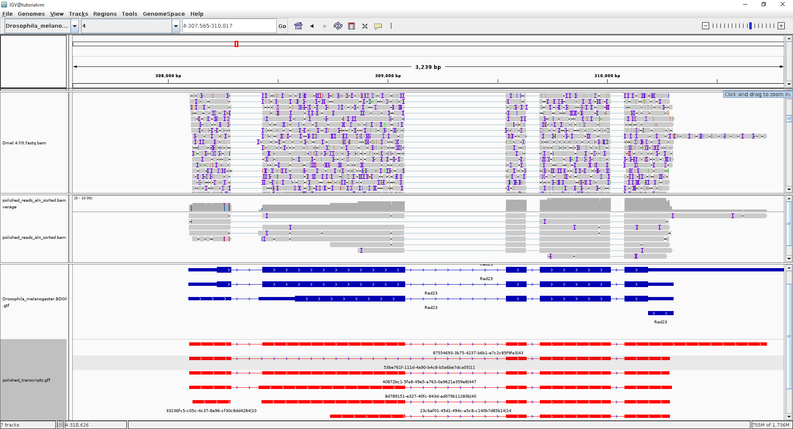

```{r setup, include=FALSE}
knitr::opts_chunk$set(tidy = FALSE, cache.extra = packageVersion('tufte'))
options(htmltools.dir.version = FALSE)
knitr::opts_chunk$set(fig.width=9, fig.height=6, warning=FALSE, message=FALSE)

library(digest)
library(ggplot2)
library(knitr)
library(RColorBrewer)
library(tufte)
library(yaml)
library(ShortRead)   # oh the irony!
library(kableExtra) 
library(pdftools)
library(data.table)

config <- yaml.load_file("config.yaml")
tutorialText   <- config$tutorialText

##
# the readFastq method from ShortRead does not handle bzip files very well - let´s use the 
# uncompressed file that has been already been unpacked within the required Snakefile
rawData <- file.path(getwd(), "RawData", gsub("(\\.gz$)|(\\.bz2$)", "",config$raw_fastq))

pycData <- file.path(getwd(), "Analysis", "Pychopper", 
                     paste(gsub("(\\.gz$)|(\\.bz2$)", "", config$raw_fastq), "pychop.fastq", sep="."))

slurpContent <- function(filename) {
  include = as.logical(tutorialText)
  if (include) {
    paste(readLines(filename),collapse="\n")
  }
}
```


`r slurpContent("Static/TutorialPreamble.md")`

# Review of starting sequence collections

It is recommended to review the sequence characteristics for the sequence libraries that have been prepared for the gene annotation and isoform discovery analysis. The statistics shown in the table below have been produced using the R **`ShortRead`** package (see @R-ShortRead). 


```{r startingData, echo=FALSE}
ncalc <- function(len.vector, n) {
  # N50 - length such that scaffolds of this length or longer include half the bases of the assembly
  len.sorted <- rev(sort(len.vector))
  len.sorted[cumsum(len.sorted) >= sum(len.sorted)*n][1]
}


lcalc <- function(len.vector, n) {
  len.sorted <- rev(sort(len.vector))
  which(cumsum(len.sorted) >= sum(len.sorted)*n)[1]
}


processQCFastq <- function(file) {
  fastq <- readFastq(file)
  c(
    reads = formatC(length(fastq), big.mark=","),
    mbs = formatC(round(sum(width(fastq)) / 1000 / 1000, digits=1), big.mark=","),
    min = min(width(fastq)),
    max = max(width(fastq)),
    mean = round(mean(width(fastq)), digits=1),
    median = round(median(width(fastq)), digits=0),
    qval = round(mean(alphabetScore(fastq) / width(fastq)), digits=1),
    gc = round(mean(letterFrequency(sread(fastq), "GC")  / width(fastq)) * 100, digits=1),
    n50 = ncalc(width(fastq), n=0.5),
    l50 = lcalc(width(fastq), n=0.5),
    n90 = ncalc(width(fastq), n=0.9),
    l90 = lcalc(width(fastq), n=0.9)
  )
}

data <- lapply(c(rawData, pycData), processQCFastq)
qcData <- data.frame(data)
colnames(qcData) <- c("RawData", "Pychopper")

```

```{r summaryStatsTable, echo=FALSE, cache=FALSE, resize.width=100}
knitr::kable(qcData, caption="Summary statistics for the cDNA data processed before and after PyChopper filtering", booktabs=TRUE, table.envir='table*', linesep="")  %>%
  kable_styling(latex_options=c("hold_position", font_size=9)) 
```

The summary statistics displayed in the table above include observational metrics including the number of reads, information on the longest, shortest and mean sequence read lengths and other information that includes GC content, N50 and N90 read lengths. The first result column describes the sequence characteristics of the raw sequence collection; the second column describes the sequences following the **`pychopper`** analysis.

**`pychopper`** selects for sequence reads that contain the appropriate adapter sequences at each end of the sequence read. These adapter sequences are also used to orientate the sequences into the correct or stranded orientation. 

Running **`pychopper`** on your sequence collection will reduce the total number of reads but will qualitatively increase the utility of the library for isoform discovery. The table above should be reviewed to see how the starting sequence library has been transformed.


```{r, echo=FALSE}

# NA12878-cDNA-1D.chr20.filt.fastq.pychop.stats
pycStats <- file.path(getwd(), "Analysis", "Pychopper", 
                     paste(gsub("(\\.gz$)|(\\.bz2$)", "", config$raw_fastq), "pychop.stats", sep="."))
pycStats <- data.table::fread(pycStats)
mstats <- melt(as.matrix(c(classified=as.numeric(pycStats[1,"+"] + pycStats[1,"-"]),
                           unclassified=as.numeric(pycStats[1,"unclassified"]))))

ggplot(mstats, aes(Var1, value)) + geom_histogram(stat="identity", fill="steelblue") + labs(title="histogram showing Pychopper cDNA read classification") + xlab("Pychopper full length classification") + ylab("Count (reads)")

```

The figure above shows a the distribution of reads that have been called as either full length (classified) or not being full length (unclassified). If too many reads have been removed this could be an indication of problems during library preparation and you would be recommended to discuss your library preparations with a member of our Technical team.


```{r, echo=FALSE}
#knitr::include_graphics(pychopperPage1)
ggplot(melt(as.matrix(pycStats[,c(1,2)])), aes(Var2, value)) + geom_histogram(stat="identity", fill="steelblue") + labs(title="histogram showing distribution of Pychopper cDNA orientation") + xlab("Pychopper called sequence strand") + ylab("Count (reads)")
```


The figure above shows the distribution of Pychopper classifications for sequence reads oriented in the (+) or (-) direction.


```{r lengthdistribution, include=TRUE, cache=FALSE, echo=FALSE}

# https://stackoverflow.com/questions/6461209/how-to-round-up-to-the-nearest-10-or-100-or-x
roundUpNice <- function(x, nice=seq(from=1, to=10, by=0.25)) {
    if(length(x) != 1) stop("'x' must be of length 1")
    10^floor(log10(x)) * nice[[which(x <= 10^floor(log10(x)) * nice)[[1]]]]
}

fastq <- readFastq(rawData)
sequenceSet <- as.data.frame(cbind(as.character(id(fastq)), width(fastq), alphabetScore(fastq)/width(fastq) ,"Raw"), stringsAsFactors=FALSE)
colnames(sequenceSet) <- c("seqId", "length", "quality", "set")

pycIds <- gsub(".+ ", "", as.character(id(readFastq(pycData))))
sequenceSet[which(sequenceSet$seqId %in% pycIds), "set"] <- "PyChopper"
sequenceSet$length <- as.numeric(sequenceSet$length)
sequenceSet$quality <- as.numeric(sequenceSet$quality)

upperLimit <- roundUpNice(as.numeric(quantile(x=sequenceSet$length, probs=c(0.995))))
histogramBinCount <- 40
breakVal = roundUpNice(upperLimit / histogramBinCount)

breaks <- seq(0, to=upperLimit, by=breakVal)

rawS <- table(cut(subset(sequenceSet, set=="Raw")$length, breaks, include.lowest=TRUE, right=FALSE))
pycS <- table(cut(subset(sequenceSet, set=="PyChopper")$length, breaks, include.lowest=TRUE, right=FALSE))

lengthDist <- data.frame(length=head(breaks, -1), raw=as.vector(rawS), pychop=as.vector(pycS))

lengthDistMelt <- reshape2::melt(lengthDist, id.vars=c("length"))

ggplot(lengthDistMelt, aes(x=length, fill=variable, y=value)) +
  geom_bar(stat="identity") +
  xlab("Read length\n") + ylab("Number of reads\n") +
  scale_fill_manual("Read QC", values=c("raw"=brewer.pal(6, "Paired")[1], "pychop"=brewer.pal(6, "Paired")[2])) +
  scale_x_continuous(limits=c(-breakVal,upperLimit), breaks=pretty(sequenceSet$length,n=40)) +
  labs(title="Histogram showing distribution of read lengths before and after PyChopper filtering", fill="filter")

```


# Pinfish

The **`pinfish`** software is run by the **`snakemake`** workflow management software and the results from the analysis are stored in the folder

`Analysis/Pinfish/`

The **`pinfish`** workflow is described fully at its [github page](https://github.com/nanoporetech/pinfish) and at the [pipeline-pinfish-analysis page](https://github.com/nanoporetech/pipeline-pinfish-analysis). The working folder contains a number of intermediate files; the key result files include

* **`corrected_transcriptome_polished_collapsed`** is a fasta format sequence file that describes the transcript consensus sequence following clustering and **`racon`** sequence correction
* **`polished_transcripts_collapsed.gff`** is a gff format annotation file that describes the genes identified and their isoforms following clustering and sequence correction.

 

# GffCompare

The [GffCompare](https://github.com/gpertea/GffCompare) methods provide a collection of tools that can be used to look for overlapping and novel features within and between genome annotation **`GFF`** files. The cluster and polished transcript annotations from **`pinfish`** are compared to the reference genome annotation. Each provided transcript is analysed to define if it novel (absent from the reference database), identical to a known transcript or similar to a known transcript..

**`GffCompare`** is run during the **`snakemake`** process. The method is run using the specified GFF genome annotation provided in the config file (``` `r  gsub("(\\.gz$)|(\\.bz2$)", "", gsub(".+/","", config$genome_annot))` ```) and with the following configuration parameters 

* **`-r`**  specifies reference genome
* **`-R`**  causes GffCompare to ignore reference transcripts that are not overlapped by any transcript in input GFF
* **`-M`**  discard (ignore) single-exon transfrags and reference transcripts
* **`-C`**  Discard the “contained” transfrags from the .combined.gtf output. By default, without this option, GffCompare writes in that file isoforms that were found to be fully contained/covered (with the same compatible intron structure)
* **`-K`**  do NOT discard any redundant transfrag matching a reference


```{r, echo=FALSE, comment=""}
cat(paste(readLines("Analysis/GffCompare/nanopore.stats"),collapse="\n"))
```

The output above is from the GffCompare summary statistics. This describes the number of transcripts that were identified within the **`pinfish`** analysis that are non-redundant and are overlapping with the provided reference annotation. Sensitivity and precision of annotation are compared with the reference. This output also provides information on the novelty of transcribed features.

Sensitivity = $TP/(TP+FN)$

Precision = $TP/(TP+FP)$

The analysis here only considers the reference genes that are partially or completely covered by **`pinfish`** transcripts. The sensitivity will be determined by the number of starting cDNA sequence reads and the diversity of gene expression that was represented within the starting cDNA collection.

The **`GffCompare`** software classifies transcripts within its output files into classes that include ("=", "u", "c") and others. These define how a transcript can be best described relative to the provided reference annotation.


The figure above is from the **`GffCompare`** software webpages at John Hopkins University. This figure describes the different codes and provides cartoons illustrating the differences with canonical genes.

Summary statistics for the isoforms contrasted to the reference annotation are provided in the **`GffCompare/nanopore.tracking`** results file. These **`GffCompare`** codes can be plotted as a histogram.

```{r, echo=FALSE}

tracking <- data.table::fread("Analysis/GffCompare/nanopore.tracking", stringsAsFactors=FALSE, sep="\t", header=FALSE)
ggplot(tracking, aes(V4)) + geom_histogram(stat="count", fill="steelblue") + labs(title="histogram showing GffCompare classes for annotated transcripts") + xlab("GffCompare class")

```

The histogram in the figure above shows the distribution of **`GffCompare`** annotated transcripts. There are **`r length(which(tracking$V4 == "="))`**  transcripts assigned code **`=`** or corresponding to an exact match with an annotated gene. **`r length(which(tracking$V4 == "u"))`** transcripts are undefined in the provided genome annotation GFF file. These transcripts could represent novel genes. The other codes together account for **`r round((nrow(tracking) - length(which(tracking$V4 == "=" | tracking$V4 == "u"))) / nrow(tracking) * 100, digits=1)`** **%** of the sequence reads and represent potentially novel isoforms with a variety of missing exons, retained introns and more complex multi-exon events. 

GffCompare finally collapses transcribed-fragments (transfrags) into the single longest transcript that shares the same patterns of intron boundaries to produce a non-redundant set of transcripts. 

```{r, comment=NA, echo=FALSE}
# select for the tracking data that corresponds to transcripts of a given class (u in this case)
usegffclass = "j"

printGFFclass <- function(usegffclass) {
  gffclasssel <- t(data.frame(strsplit(gsub("^[^:]+:","",unlist(tracking[which(tracking$V4 == usegffclass),5])),"\\|")))
  
  gff <- data.table::fread("Analysis/GffCompare/nanopore.combined.gtf")
  gffTranscripts <- which(gff$V3=="transcript")
  gffTranscripts <- as.data.frame(cbind(gffTranscripts,gsub("\\|.+","",gsub(".+oId \"","",unlist(gff[gffTranscripts,9])))), stringsAsFactors=FALSE)
  gffTranscripts[,1] <- as.numeric(gffTranscripts[,1])
  
  gffCoords <- gff[gffTranscripts[match(gffclasssel[,2],  gffTranscripts[,2]),1],]
  gffCoords$interval <- gffCoords[,5] - gffCoords[,4]
  gtype <- gff$V3
  
  #check exon count ...
  # (diff(sort(append(which(gtype=="transcript"), length(gtype)+1), decreasing=FALSE))-1)[gffTranscripts[match(gffclasssel[,2],  gffTranscripts[,2]),1]]
  gffCoords$exoncount <- gffclasssel[,4]
  # concordant in test sets
  
  gffCoords <- data.frame(gffCoords)[,c(1,2,3,4,5,7,10,11)]
  colnames(gffCoords) <- c("Chr", "Pipeline", "Feature", "Start", "Stop", "Strand", "Interval", "Exons")
  
  # we can have NA values in this table since the tracking data is based on a redundant dataset and the gff is nonred
  if (length(which(is.na(gffCoords[,1])))>0) { gffCoords <- gffCoords[-which(is.na(gffCoords[,1])),] }
  
  kable(gffCoords, format="pandoc", caption=paste("Table summarising transcripts identified by the Pinfish that correspond to GffCompare class \"",usegffclass,"\"",sep=""))

}

printGFFclass("u")
```

The table above shows the transcripts that were identified as potential novel transcripts. Since the classification of novelty is based on the provided annotation we recommend that the annotated isoform is checked against the reference genome to investigate novelty.


```{r, echo=FALSE}
printGFFclass("j")
```

The table above shows the transcripts that have been assigned to the class "multi-exon with at least one junction match". This classification could include a variety of novel isoforms - these can be checked using a genome browser. This is covered in the next section.


# IGV

The Integrative Genomics Viewer (**`IGV`**) is a visualisation tool for genomics data that has been installed by **`conda`**. The software provides functionality for the display of sequence mapping data from BAM files that can subsequently be overlaid with "tracks" of information that can include depth-of-coverage for mapping data and gene annotations. 

**`IGV`** can be started from the command line by using the command `igv`.

In this tutorial we recommend that you instead encourage **`IGV`** to display sequence information around a gene of interest. In the last table a collection of potentially novel transcripts was displayed. We would like to explore the transcript information around this gene. The command below will open the **`IGV`** browser to the appropriate genome coordinates - in this example we are using the feature with coordinates `[Chr 20] Start=34089431, Stop=34112220`.

```
igv -g ./ReferenceData/Homo_sapiens.GRCh38.dna.primary_assembly.fa \
./Analysis/Minimap2/NA12878-cDNA-1D.chr20.filt.fastq.bam,\
./Analysis/Minimap2/polished_reads_aln_sorted.bam,\
./ReferenceData/Homo_sapiens.GRCh38.94.chromosome.20.gff3,\
./Analysis/Pinfish/polished_transcripts_collapsed.gff \
20:34089431-34112220
```



The figure above shows a screenshot from the **`IGV`** genome browser. At the bottom, shaded in red, is a gene track for a transcript identified by **`Pinfish`** and annotated by **`GffCompare`** as representing a variant isoform. The figure shows the location of where the **`Pychopper`** mapped sequence reads have been anchored to the reference genome (along with a summary of depth-of-coverage). The gene tracks from the reference human genome are shaded in blue. A comparison of the Pinfish/GffCompare transcript with the annotated human gene annotation suggests that the transcript is from gene EIF2S2 and that the final exon (the gene is on the reverse DNA strand) is truncated relative to the reference annotation. This is supported by the sequence mapping.

We recommend that novel transcripts and transcripts with an apparently novel structure are reviewed within a genome browser.


# Glossary of Terms

* __knit__ is the command to render an Rmarkdown file. The knitr package is used to embed code, the results of R analyses and their figures within the typeset text from the document. 

* __L50__  describes the number of sequences (or contigs) that are longer than, or equal to, the N50 length and therefore include half the bases of the assembly

* __N50__  describes the length (read length, contig length etc) where half the bases of the sequence collection are contained within reads/contigs of this length or longer

* __Rmarkdown__ is an extension to markdown. Functional R code can be embedded in a plain-text document and subsequently rendered to other formats including the PDF format of this report.

* __QV__  the quality value, -log10(p) that any given base is incorrect. QV may be either at the individual base level, or may be averaged across whole sequences


# Reproducible Research - Produce your own report

This report has been created using **`Rmarkdown`**, publicly available **`R`** packages, and the \LaTeX document typesetting software for reproducibility. For clarity the **`R`** packages used, and their versions, is listed below.

\fontsize{8}{12}

```{r sessionInfo, eval=TRUE, echo=FALSE, comment=NA}
options(width = 100)
utils:::print.sessionInfo(sessionInfo()[-7], locale=FALSE)
```

\fontsize{10}{14}


It is also worth recording the versions of the software that have been used for the analysis.

\fontsize{8}{12}

```{r, engine='bash', echo=FALSE, comment=NA}
source ~/.bashrc
source activate Pinfish
conda list "samtools|minimap2|snakemake|rstudio|pinfish|pychopper|racon|gffread|gffcompare|igv|openjdk"
```

`r slurpContent("Static/TutorialPostamble.md")`


\pagebreak


# References and citations


