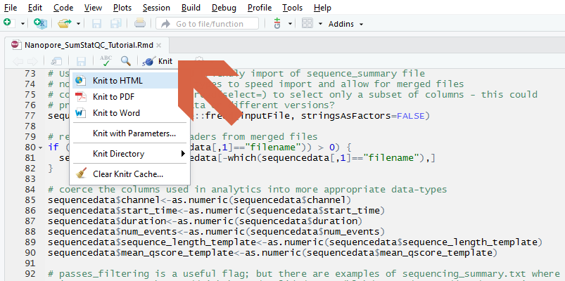

******************

# 1. Introduction:


### Overview:

The **Pinfish tutorial** is intended as a functional guide to demonstrate how the Oxford Nanopore Technologies Pinfish software may be used to annotate genes, and their isoforms, against a reference genome sequence using long sequence read cDNA or direct-RNA data. A drosophila cDNA dataset included with the tutorial demonstrates the key aspects of the workflow, and introduces **`GffCompare`** to enable the comparison of identified gene isoforms with reference genome annotations. This enables discovery and characterisation of novel isoforms. 

### Features:

Sufficient information is provided in the tutorial such that the workflow can be tested, validated, and replicated. 

* What are the read characteristics for my starting sequence collection?
* Which fraction of my sequence reads appear full length?
* How many genes and transcripts are identified?
* How do the identified transcripts correspond to the reference genome annotation?
* Which pinfish annotations are from novel genes or gene isoforms?
* How can I visually explore a specific gene isoform?

******************

# 2. Getting Started:

This tutorial relies on **`conda`** for the installion of software that includes **`R`**, **`Rstudio`**, **`minimap2`**, **`samtools`**, **`IGV`**, **`pychopper`**, **`pinfish`** and **`GffCompare`**. It is necessary to have **`git-lfs`** installed on your system to download the accompanying long-read sequence and metadata files that are stored using Git Large File Storage. Please see [accompanying Git Large File Storage note](https://github.com/nanoporetech/bioinformatics-tutorials/blob/master/git-lfs.md) for further information on how this may be best installed.

### Input and Output: 

This tutorial uses the code contained within the Github repository and an experimental design file (config.yaml) that processes the provided cDNA sequence file (in fastq format) with the pinfish analytical workflow. 

### Dependencies:

This tutorial requires a computer running Linux (Centos7, Ubuntu 18_10, Fedora 29). >16Gb of memory would be recommended. The tutorial has been tested on minimal server installs of these operating systems.

Other dependencies include

* **`bash`** shell  for interacting with the computer

### Installation:

1. The tutorial's software requirements are managed by the **`conda`** package manager. Please install **`conda`** as described at [https://conda.io/docs/install/quick.html](https://conda.io/docs/install/quick.html). You will need to accept the license agreement during installation, and we recommend that you allow the conda installer to prepend its path to your `.bashrc` file when asked.
```
    wget https://repo.anaconda.com/miniconda/Miniconda3-latest-Linux-x86_64.sh
    bash Miniconda3-latest-Linux-x86_64.sh
    bash
```
2. Download the **`pinfish tutorial`** & example files into a folder named `Pinfish`. This tutorial requires the **`git-lfs`** large file support capabilities which should be installed through **`conda`** first.
```
    conda install -c conda-forge git-lfs
    git lfs install
    git clone https://github.com/nanoporetech/ont_tutorial_pinfish.git Pinfish
```
3. Change your working directory into the new `Pinfish` folder
```
    cd Pinfish
```
4. Install conda software dependencies with
```
    conda env create --name Pinfish --file environment.yaml
```
5. Initialise conda environment with 
```
    source activate Pinfish
```


#### Compilation From Source

This tutorial should not require the compilation of any software. The **`conda`* software management system should manage all required bioinformatics software dependencies.


### Usage: 

In your Conda environment, and in the tutorial working directory,

1. *optional* edit the provided **`config.yaml`** file to match your own study design
2. Run the Snakefile workflow (the command assumes 4 available threads; adjust to match your computer's capabilities)
```
    snakemake -j 4 all
```
3. Render the report using results from the analysis above
```
    R --slave -e 'rmarkdown::render("Nanopore_Pinfish_Tutorial.Rmd", "html_document")'
```

The provided Rmarkdown tutorial script can also be opened directly in Rstudio

```
rstudio Nanopore_cDNA_Tutorial.Rmd
```

The report can be prepared by "knit" from the GUI as shown in the figure




******************

# 3. Results

This tutorial workflow will produce a rich description of your sequence library characteristics and will summarise the key results from the Pinfish isoform analysis. Please visit the tutorial page at [https://community.nanoporetech.com/knowledge/bioinformatics]( https://community.nanoporetech.com/knowledge/bioinformatics) for more information

******************

# 4. Help:

### Licence and Copyright:

© 2019 Oxford Nanopore Technologies Ltd.

**`ont_tutorial_pinfish`** and other Nanopore tutorials are distributed by Oxford Nanopore Technologies under the terms of the MPL-2.0 license.

### FAQs:


### Abbreviations:


* __knit__ is the command to render an Rmarkdown file. The knitr package is used to embed code, the results of R analyses and their figures within the typeset text from the document. 

* __L50__  the number of sequences (or contigs etc) that are longer than, or equal to, the N50 length and therefore include half the bases of the assembly

* __N50__  length such that sequences (or contigs etc) of this length or longer include half the bases of the sequence collection

* __Rmarkdown__ is an extension to markdown. Functional R code can be embedded in a plain-text document and subsequently rendered to other formats including the PDF format of this report.

* __QV__  the quality value - -log10(p) that any given base is incorrect. QV may be either at the individual base level, or may be averaged across whole sequences


### References and Supporting Information:

*  https://community.nanoporetech.com/knowledge/bioinformatics
*  https://www.r-project.org/
*  https://snakemake.readthedocs.io/en/stable/
*  https://bioconda.github.io/

